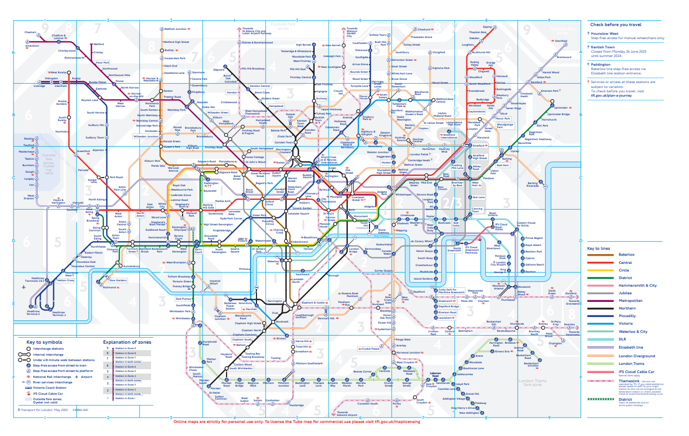
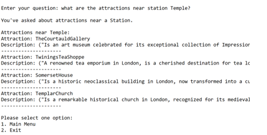
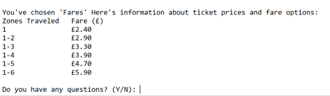
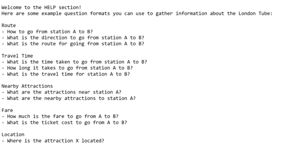
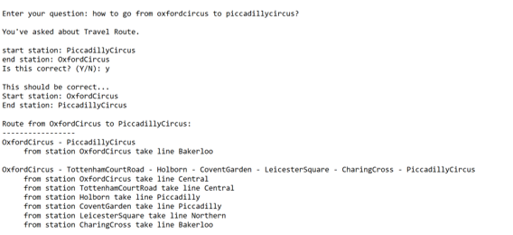
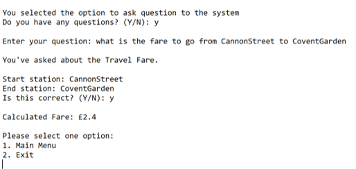
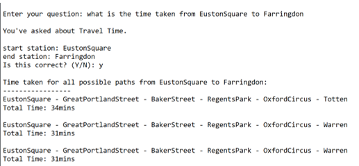
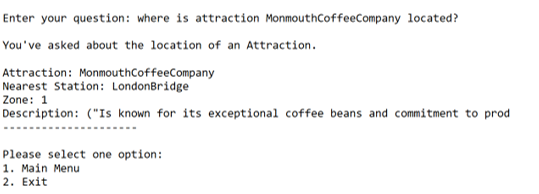

# London Tube Expert System

## Overview

The London Tube Expert System is a project that aims to provide users with intelligent insights and recommendations related to the London Underground transportation system. Leveraging expert system techniques, this project offers a user-friendly interface to interact with and gather information about the tube network.

## Features

- **Route Planning:** Find the optimal route between two stations.
- **Service Status:** Get real-time information about the service status of different tube lines.
- **Station Information:** Access details about specific tube stations, including facilities and accessibility information.
- **Travel Fare:** Calculate the travel fare to go from one station to another.
- **Travel Time:** Calculate the travel time to go from one station to another.
- **Attractions:** Get information about attractions, including descriptions and the nearest tube station.
- **Attractions Near Stations:** Explore a list of attractions near a specific tube station.

## Getting Started

### Prerequisites
- [CLIPS](https://www.clipsrules.net/) installed

### Installation

1. Clone the repository:

   ```bash
    git clone https://github.com/pranitdarekar/london-tube-expert-system.git
### Running the Expert System

1. Open CLIPS IDE.

2. Change the directory to the project files within the CLIPS IDE.

3. Load the initialization file:

   ```clips
   (load "initialize.clp")
4. Start the system using the command:
   ```clips
   (start-expert-system)
5. Interact with the expert system to extract information about the London Tube. Follow the on-screen instructions to utilize the different features and gather insights.

## Screenshots

### Screenshot 1: London Tube Map

### Screenshot 2: Attractions near a station

### Screenshot 3: Fare Chart

### Screenshot 4: HELP Menu

### Screenshot 5: Route Planning

### Screenshot 6: Travel Fare

### Screenshot 7: Travel Time

### Screenshot 8: Attraction Info


